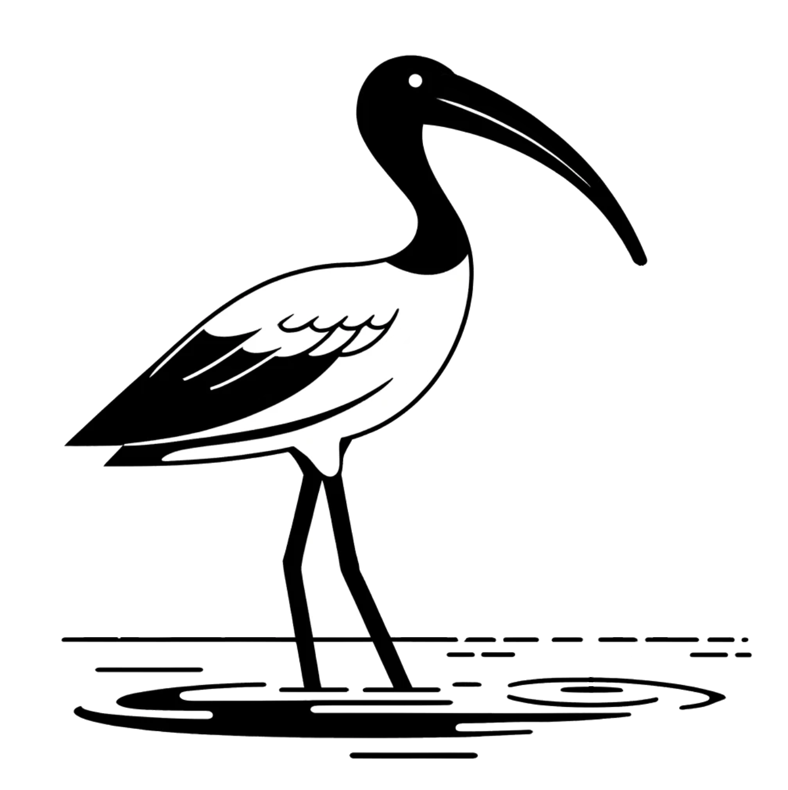

# Ibis

Ibis is the name of a collection of projects led by Dan Allison re: group coordination and collective intelligence.

## Projects

### Decisive Team

[Decisive Team](https://decisive.team) is open-source software for fast group decision-making. It is based on a 3 step decision-making protocol described on the project's [website](https://decisive.team).

### The Coordination Curriculum

The Coordination Curriculum teaches a framework for creating and participating in highly coordinated groups and networks. There are 3 levels of the curriculum.

* Level 1: Reciprocal Integrity
* Level 2: [Democracy Improv](https://democracyimprov.org)
* Level 3: [Collective Providence](https://collectiveprovidence.org)

Details coming soon.